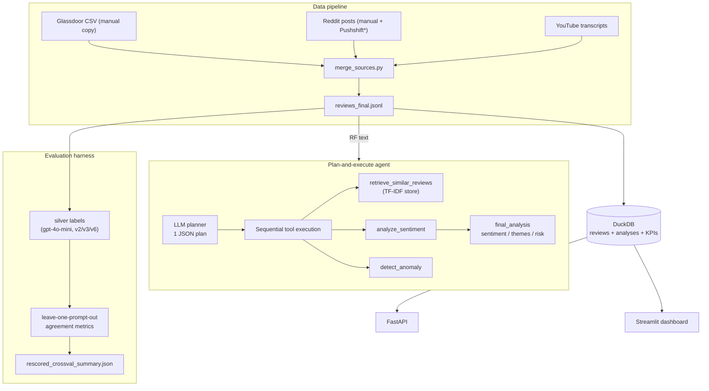

# ReviewInsight AI

An end-to-end LLM pipeline that analyzes warehouse employee reviews — sentiment, themes, and retention-risk classification — with a tool-using agent, a prompt A/B-testing harness, and an honest evaluation framework.

> **This is a portfolio/research prototype.** It is not production software,
> it has never been deployed, and all evaluation numbers are agreement with
> LLM-generated labels — not accuracy against human ground truth.

---

## The problem

Employee reviews on Glassdoor, Reddit, and YouTube hold early warnings about
workplace problems — safety issues, burnout, management failures — but they
are unstructured, spread across platforms, and impossible to aggregate
manually. This project explores whether an LLM pipeline can turn that text
into structured, queryable signals.

## What the system actually does

- **Data pipeline**: merges Glassdoor reviews, Reddit posts, and YouTube
  transcript chunks into one schema ([`src/processing/merge_sources.py`](src/processing/merge_sources.py)).
- **LLM labeling**: six prompt templates (zero-shot → detailed, few-shot,
  chain-of-thought) score each review 1–5, tag up to 3 themes from a fixed
  taxonomy, and assign a low/medium/high review-risk class
  ([`src/prompts/templates.py`](src/prompts/templates.py)).
- **Plan-and-execute agent**: one LLM planning call, then sequential tool
  execution (retrieval → sentiment → anomaly detection) — ReAct-*inspired*,
  not an iterative ReAct loop ([`src/agent/controller.py`](src/agent/controller.py)).
  A true iterative ReAct variant lives in
  [`src/agent/langchain_agent.py`](src/agent/langchain_agent.py) (optional
  LangChain dependencies; never fully exercised due to dependency conflicts).
- **Context retrieval**: lightweight TF-IDF vector store, no serialization,
  works offline on a fresh clone ([`src/agent/embeddings.py`](src/agent/embeddings.py));
  an optional sentence-transformers backend is supported.
- **Memory + drift detection**: analyses append to a JSONL log; theme
  distributions are compared against a baseline with KL divergence
  ([`src/agent/memory.py`](src/agent/memory.py), [`src/agent/drift.py`](src/agent/drift.py)).
- **Interfaces**: FastAPI service ([`api/main.py`](api/main.py)) and a
  Streamlit dashboard ([`dashboard/app.py`](dashboard/app.py)).

## Architecture



\* The Pushshift Reddit scraper no longer works (HTTP 403 since 2023); the
manual-entry path and the shipped fixtures are what make the pipeline
runnable today.

## Dataset summary and provenance

| Source | Local corpus | Tracked here |
|---|---|---|
| Glassdoor | 100 reviews (manual copy, 2024–2025) | header-only template |
| Reddit | 57 posts (37 manual paste, 25 Pushshift) | 3 synthetic posts |
| YouTube | 18 transcript chunks (8 videos) | 1 synthetic video |
| **Merged** | **175 reviews** (`reviews_final.jsonl` locally) | **9 synthetic reviews** |

The repository **does not redistribute third-party review or transcript
text**. Tracked files under `data/` are small hand-authored synthetic
fixtures with the same schema, so tests and demos run on a fresh clone. The
real corpus is kept locally in gitignored `data_local/`. Full details,
collection dates, licensing uncertainty, and known provenance gaps:
**[DATASET_CARD.md](DATASET_CARD.md)**.

## Methodology

1. **Silver labeling** — LLM-generated reference labels (no human labels;
   that is why every metric below says *agreement*). See
   [docs/SILVER_LABELS_GUIDE.md](docs/SILVER_LABELS_GUIDE.md).
2. **Prompt A/B testing** — 6 prompt versions; `k_shot` is a runtime setting
   that prepends few-shot examples (every template ships the same examples,
   so a prompt named "Zero-shot" is only zero-shot at `k_shot=0`).
3. **Leakage-controlled evaluation** — splits by unique review ID;
   leave-one-prompt-out excludes the evaluated prompt's own labels; results
   report label-row *and* unique-review counts. Details and caveats:
   [docs/EVALUATION.md](docs/EVALUATION.md).

## Results (validated)

The only results file in the repo is
[`data/evaluation/rescored_crossval_summary.json`](data/evaluation/rescored_crossval_summary.json):
an **offline re-scoring of the original February 2026 predictions**
(`gpt-4o-mini`, zero-shot) under the corrected leave-one-prompt-out protocol.
No new model calls were made. **Label type: LLM-generated silver labels.**

| Prompt | label rows | unique reviews | self-labeled rows excluded | Theme F1 | Sentiment agr. | Risk agr. |
|---|---|---|---|---|---|---|
| v1.0 Zero-shot Basic | 50 | 17 | 0 | 4.7% | 78.0% | 74.0% |
| v2.0 Role Enhanced | 33 | 17 | 17 | 87.3% | 78.8% | 81.8% |
| v3.0 Detailed + examples | 33 | 17 | 17 | **91.4%** | **87.9%** | **84.8%** |
| v4.0 Chain of Thought | 50 | 17 | 0 | 2.7% | 58.0% | 76.0% |
| v5.0 Structured Output | 50 | 17 | 0 | 85.7% | 56.0% | 76.0% |
| v6.0 Detailed Analysis | 34 | 17 | 16 | 81.8% | 85.3% | 67.6% |

## Evaluation limitations (read before citing anything)

- **These are not accuracy numbers.** Reference labels came from the same
  LLM family as the tested prompts. Agreement between similar LLM prompts is
  structurally optimistic.
- **17 unique reviews.** Percentages have enormous error bars; a single
  review swings a cell by ~3-6 points.
- **The original "94.3% F1 / 98% / 100%" headline result was self-testing
  contamination** (v5 scored against v5's own labels) and is retained only as
  a measurement-error case study. Correcting self-testing moved v2
  91.0→87.3% and v6 85.4→81.8%.
- **v1/v4's near-zero theme F1 is mostly vocabulary mismatch** (their prompts
  don't constrain themes to the fixed taxonomy), not sentiment failure.
- "Retention risk" is an **LLM-generated classification of review text**, not
  observed attrition and not a validated prediction.
- `confidence` fields in label files are hard-coded constants, not
  calibrated scores.
- Historical predictions, not a fresh run; re-running today would differ.

## Installation

Requires **Python 3.11** (the pinned numpy/scipy builds don't support 3.13+).

```bash
git clone https://github.com/oleeveeuh/extern.git
cd extern

python3.11 -m venv .venv
source .venv/bin/activate          # Windows: .venv\Scripts\activate

pip install -r requirements.txt            # core (offline features)
pip install -r requirements-dev.txt        # pytest, httpx, ruff
# optional: pip install -r requirements-optional.txt   # LLM, dashboard, etc.

cp .env.example .env                       # optional; only LLM features need a key
```

Dependencies are split: `requirements.txt` (core, offline),
`requirements-optional.txt` (OpenAI, Streamlit/Plotly, sentence-transformers,
LangChain, scraping, notebooks), `requirements-dev.txt` (test/lint tooling).

## Offline quick start (no API key)

```bash
python examples/offline_demo.py
```

This runs the full pipeline on the synthetic fixtures: inter-prompt agreement
across the silver-label fixture, TF-IDF context retrieval, and memory +
KL-divergence drift detection.

Other offline commands:

```bash
python src/processing/merge_sources.py      # rebuild merged corpus from fixtures
python src/processing/validate_data.py      # run data validation checks
python src/agent/embeddings.py              # TF-IDF retrieval demo
python scripts/rescore_crossval.py          # re-score saved predictions (needs data_local/)
```

## Optional: OpenAI-enabled usage

```bash
export OPENAI_API_KEY=sk-...                # or put it in .env

# Label reviews with a chosen prompt version (costs API money)
python run_experiments.py --generate-silver --prompt v5 --samples 20

# Leave-one-prompt-out cross-prompt evaluation
python evaluate_crossval.py

# Plan-and-execute agent on one review
python -m src.agent.controller
```

Every evaluation result records prompt version, model, timestamp, split
method, and label source; dry-run mode produces no metrics by design.

## API and dashboard

```bash
# API (works without a key; /analyze needs one at request time)
uvicorn api.main:app --port 8000
curl http://127.0.0.1:8000/health
curl -X POST http://127.0.0.1:8000/analyze \
     -H 'Content-Type: application/json' \
     -d '{"text": "Mandatory overtime every week is exhausting"}'
```

Endpoints: `POST /analyze`, `GET /memory/stats`, `GET /tools`,
`GET /health`, `GET /docs` (Swagger). CORS origins are configured via the
`ALLOWED_ORIGINS` env var (empty = no cross-origin browser access). More:
[api/README.md](api/README.md).

```bash
# Dashboard (requires requirements-optional.txt)
pip install -r requirements-optional.txt
streamlit run dashboard/app.py
```

The dashboard reads the local DuckDB (build it from the fixtures with
`python src/pipelines/build_database.py`) and works without an API key except
for the Analyze tab.

## Tests and verification

```bash
pytest                          # 51 offline tests; no API key, no network
bash scripts/verify.sh          # ruff + pytest + offline end-to-end demo
ruff check .                    # static checks (config in pyproject.toml)
```

CI (GitHub Actions) runs the same three steps on Python 3.11 for every push.
Tests specifically guard the evaluation-integrity properties: a prompt is
never scored against its own labels, duplicate reviews cannot inflate counts,
dry-run results never carry metrics, and SQL search is parameterized.

## Repository structure

```
extern/
├── api/                    # FastAPI service
├── dashboard/              # Streamlit dashboard
├── docs/                   # evaluation + silver-label methodology
├── examples/               # offline end-to-end demo
├── scripts/                # rescore, transcripts, sentiment, verify.sh
├── src/
│   ├── agent/              # controller, tools, memory, drift, vector store
│   ├── analysis/           # batch LLM processing (optional deps)
│   ├── database/           # DuckDB manager
│   ├── evaluation/         # prompt evaluation harness
│   ├── labeling/           # human/silver labeling CLIs
│   ├── pipelines/          # database build
│   ├── processing/         # merge + validate
│   ├── prompts/            # 6 prompt templates
│   └── scraping/           # Pushshift scraper (defunct API) + manual entry
├── tests/                  # offline pytest suite
├── data/                   # synthetic fixtures only (see DATASET_CARD.md)
├── data_local/             # real corpus, gitignored, never redistributed
├── DATASET_CARD.md
└── requirements*.txt
```

## Security, privacy, ethics, licensing

- **Code**: MIT ([LICENSE](LICENSE)). **The MIT license does not cover the
  third-party review/transcript content** described in [DATASET_CARD.md](DATASET_CARD.md);
  no right to redistribute that content is claimed or granted.
- Credentials live in `.env` (gitignored); `.env.example` documents the
  variables. No secrets have ever been committed.
- API: configurable CORS, bounded request size, sanitized error responses
  (details logged server-side only), parameterized SQL throughout.
- Glassdoor/Reddit/YouTube content carries platform-specific terms and
  creator rights; this repo therefore ships synthetic fixtures only.
- **Retention-risk output is an LLM classification of text**, not a
  measurement of any real person. Don't use it for decisions about people.

## Known limitations and future work

- No human-labeled ground truth (the human-labeling CLI exists but was never
  run) — until then, "accuracy" claims are impossible by construction.
- 17-unique-review evaluation; next step is a stratified human-labeled sample
  (100+ reviews) and CIs on every metric.
- The Pushshift Reddit scraper is defunct; Reddit collection would need a
  redesign against the official API.
- The custom agent plans once and executes sequentially; no re-planning from
  tool observations (the LangChain variant does iterate but was never fully
  exercised).
- Retrieval is TF-IDF lexical similarity by default; semantic retrieval needs
  the optional sentence-transformers backend and locally-built artifacts.
- Two agent implementations and one dashboard accumulated some duplication;
  consolidating them is straightforward but left as-is to keep the diff honest.
